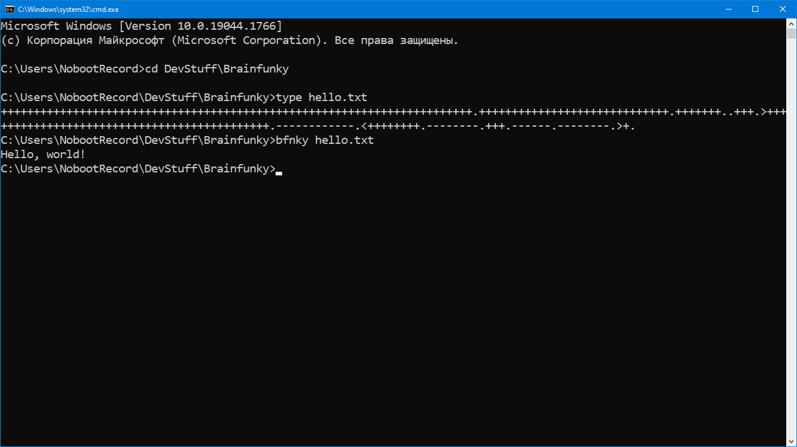

# Brainfunky (bfnky)

Ultra-tiny Brainfuck interpretator I wrote in pure C just for fun. Recommended compiling with TCC for the best performance.
Usage: bfnky scriptFileName

----------------------------

Супердупертурбоультрамегаальфабетагаммаомега-маленький и быстрый интерпретатор языка программирования Brainfuck. Написан на Си чисто по приколу, рекомендуется компилировать с TCC для лучшей производительности.
Запуск в терминале: bfnky scriptFileName

